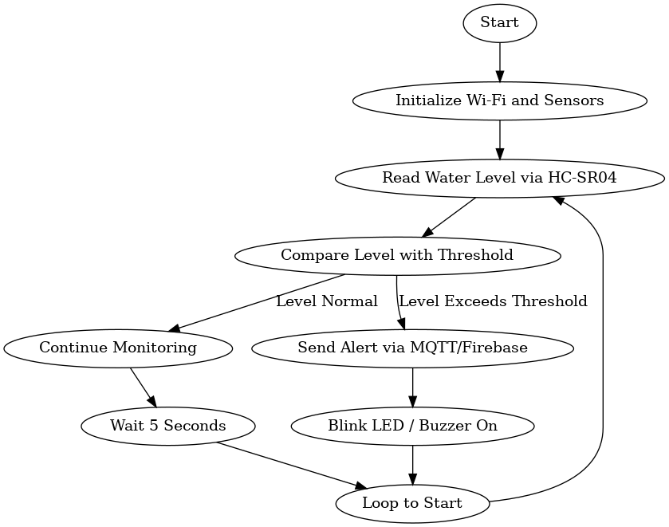

# Industrial Internet of Things Flood Monitoring System

<h3 title="hehehe"> Hey 👋, I'm BHARATH!</h3>

<a href="[[https://www.linkedin.com/in/jaskirat-singh-009348178](https://www.linkedin.com/in/bharath-s-649506323?utm_source=share&utm_campaign=share_via&utm_content=profile&utm_medium=android_app)](https://www.linkedin.com/in/bharath-s-649506323/)">
  
</a>
<a href="[https://www.instagram.com/](https://www.instagram.com/__bharath_.s/)">
  
</a>
<a href="https://www.facebook.com/">
  
</a>
<a href="https://twitter.com">
  
</a>
<br>
<br>


---

## 🚀 About the Project
The **Industrial Internet of Things Flood Monitoring System** is an IoT-based project designed to monitor water levels and detect potential flood conditions in real-time. Using an ultrasonic sensor and an ESP32 microcontroller, the system measures water levels and transmits data to Adafruit IO via MQTT. When a flood condition is detected (water level below a certain threshold), the system triggers an alert, which can be monitored remotely.

---

## 🛠️ Features

- **Real-time Water Level Monitoring:** Accurate distance measurement using ultrasonic sensors.
- **MQTT Connectivity:** Publishes water level and flood status to Adafruit IO feeds.
- **Flood Alerts:** Activates an LED and sends a notification when the threshold is crossed.
- **WiFi-enabled:** ESP32 connects to local WiFi for seamless IoT integration.
- **Easy Hardware Integration:** Minimal components required for setup.

---

## 🖥️ Tech Stack

- **Microcontroller:** ESP32
- **Sensor:** Ultrasonic (e.g., HC-SR04)
- **IoT Platform:** Adafruit IO
- **Programming Language:** C++ (Arduino)
- **Libraries:** WiFi, Adafruit_MQTT

---

## ⚡ Hardware Requirements

- ESP32 Development Board
- Ultrasonic Sensor (HC-SR04 or similar)
- LED (for flood alert)
- Jumper wires & Breadboard

---

## 🧑‍💻 Software Requirements

- Arduino IDE
- Libraries:
  - WiFi.h
  - Adafruit_MQTT.h
  - Adafruit_MQTT_Client.h

---

## 📝 Setup and Usage

1. **Hardware Wiring:**
   - TRIG of ultrasonic sensor to GPIO 5, ECHO to GPIO 18 on ESP32.
   - LED to GPIO 2 (with a resistor).

2. **Configure WiFi and MQTT:**
   - Update `ssid` and `password` in the code for your WiFi.
   - Set your Adafruit IO `AIO_USERNAME` and `AIO_KEY`.

3. **Upload the Code:**
   - Open `sketch.ino` in Arduino IDE.
   - Install required libraries.
   - Upload to ESP32.

4. **Monitoring:**
   - View water level and flood status on Adafruit IO dashboard.
   - LED lights up if flood detected.

---

## 📦 Code Structure

- **`sketch.ino`:** Main Arduino sketch handling sensor readings, MQTT, and flood logic.

<details>
  <summary>Sample Logic (click to expand)</summary>

```c++
void loop() {
  MQTT_connect();

  long distance = measureDistance();
  Serial.print("Measured Distance (cm): ");
  Serial.println(distance);

  // Send water level (0-100)
  waterLevelFeed.publish(distance);

  if (distance < floodThreshold) {
    digitalWrite(ALERT_LED, HIGH);
    floodStatusFeed.publish("ON");
    Serial.println("⚠️ Flood Alert Sent!");
  } else {
    digitalWrite(ALERT_LED, LOW);
    floodStatusFeed.publish("OFF");
    Serial.println("✅ Status Safe");
  }

  delay(5000); // every 5 seconds
}
```
</details>

---

## 📊 Demo

- **Live Simulation:**  
  [Wokwi Online Project Demo](https://wokwi.com/projects/434252500636964865)

- **Flowchart:**  
   <!-- Make sure to add your flowchart image to the repo as flowchart.png or change the filename accordingly -->

---

## 🎯 Customization

- Adjust `floodThreshold` for your desired safe water level.
- Add more outputs (buzzer, GSM, etc.) as needed.

---

## 🙋‍♂️ About Me

- 🔭 I’m currently working on IoT and automation projects.
- 🌱 I’m learning cloud integrations with microcontrollers.
- 💬 Ask me about: IoT, ESP32, Embedded Systems.
- 📫 Reach me on [LinkedIn](https://www.linkedin.com) or other socials above!

---
